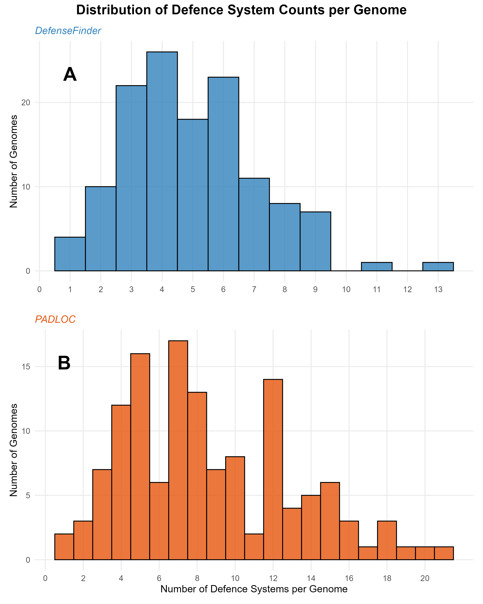
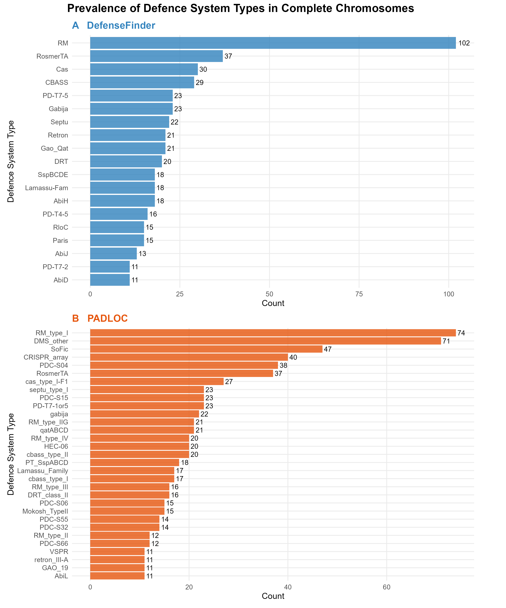
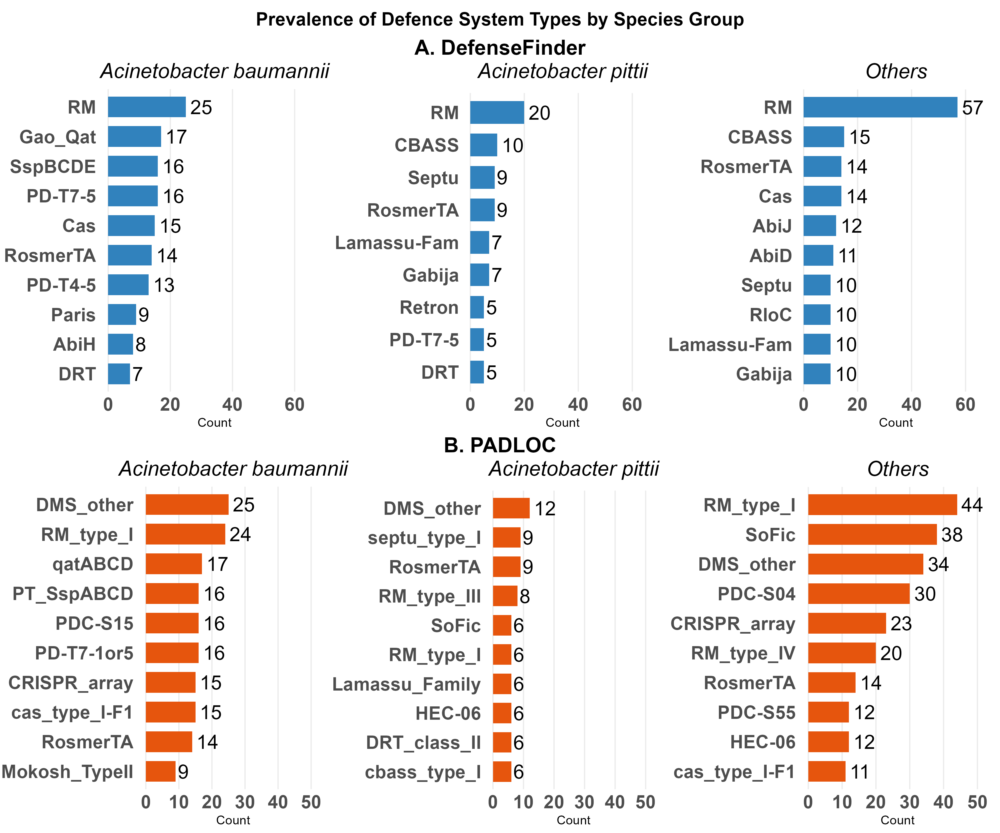
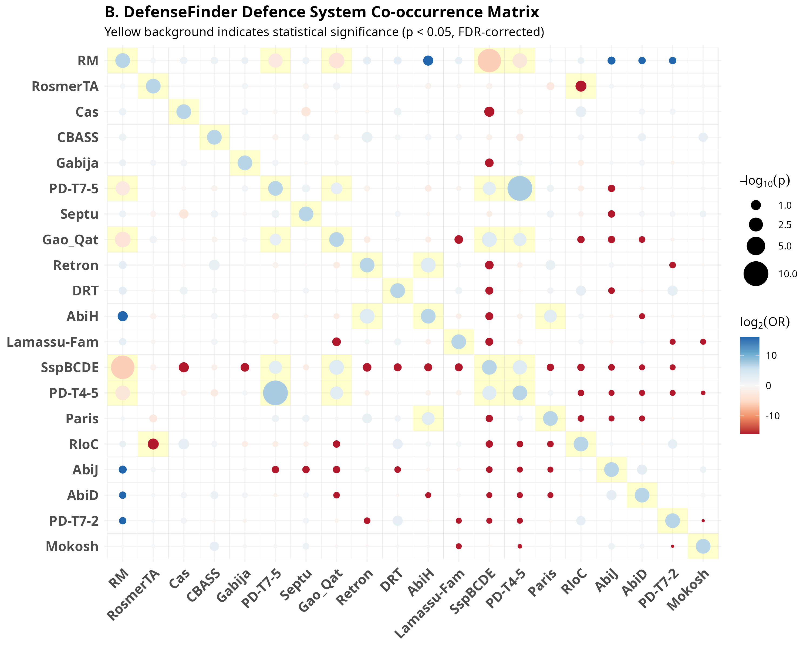
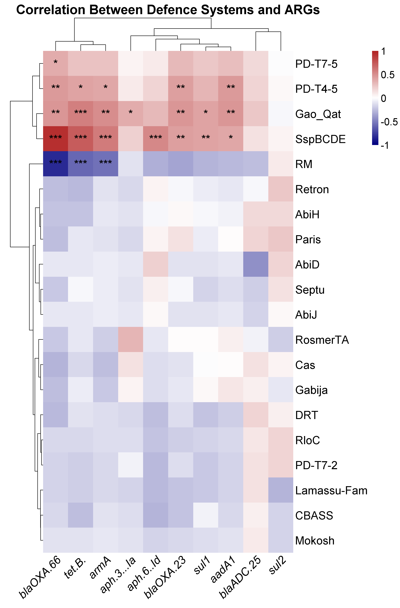

# Defence System Architecture in *Acinetobacter* Species

[](https://opensource.org/licenses/MIT)

## Project Overview

This repository contains the code, analysis, and findings from my Master's thesis research on bacterial defence systems in *Acinetobacter* species, with a focus on their relationship to antimicrobial resistance and mobile genetic elements.

*Acinetobacter baumannii* has emerged as a significant healthcare challenge due to its remarkable ability to acquire antimicrobial resistance. This project investigates the complex landscape of bacterial defence systems across different *Acinetobacter* species, examining how these systems might influence the acquisition and maintenance of resistance determinants.

## Key Research Objectives

- Map the distribution and organization of defence systems across *Acinetobacter* species
- Compare defence system predictions between DefenseFinder and PADLOC bioinformatic tools
- Analyze species-specific variations in defence strategies between *A. baumannii*, *A. pittii*, and other *Acinetobacter* species
- Explore correlations between defence systems and antibiotic resistance genes
- Investigate relationships between defence systems and mobile genetic elements

## Dataset

The analysis was performed on two distinct datasets:
- 132 complete *Acinetobacter* genomes (including 43 *A. baumannii*, 27 *A. pittii*, and 62 other *Acinetobacter* species)
- 90 contig-level assemblies of *A. baumannii* clinical isolates


## Repository Structure

- `code/`: R and Bash scripts for computational analysis
- `data/`: Metadata about genomes and example datasets
- `results/`: Key figures and findings
- `docs/`: Additional documentation including thesis summary

## Methodology Overview

The bioinformatic workflow involved:

1. **Genome Analysis**: Using DefenseFinder and PADLOC to predict defence systems
2. **Antibiotic Resistance Gene Detection**: Identification using ResFinder
3. **Mobile Genetic Element Analysis**: BLAST-based identification of integrative mobile elements
4. **Statistical Analysis**: Correlation analysis using Fisher's exact tests and Spearman's rank correlation
5. **Visualization**: Generation of heatmaps, network visualizations, and statistical plots


## Prerequisites

- R (version 4.4.0 or higher)
- [DefenseFinder](https://github.com/mdmparis/defense-finder)
- [PADLOC](https://github.com/padlocbio/padloc)
- [ResFinder](https://github.com/genomicepidemiology/resfinder)
- NCBI E-utilities (for genome download)

## Installation

1. Clone this repository: https://github.com/vikos77/Acinetobacter-defence-systems.git

2. Install R and required packages

3. Install bioinformatics tools:
DefenseFinder: Follow instructions at [DefenseFinder](https://github.com/mdmparis/defense-finder)
PADLOC: Follow instructions at [PADLOC](https://github.com/padlocbio/padloc)
Resfinder : Follow instructions at [Resfinder](https://github.com/genomicepidemiology/resfinder)


### Key Findings

### 1. Defense System Distribution and Tool Comparison


**DefenseFinder vs. PADLOC Detection Patterns**:
- DefenseFinder identifies 3-6 defense systems per genome (mean = 5.0), with most genomes clustering around 4 systems
- PADLOC detects higher counts (mean = 8.6), with a broader distribution extending up to 20 systems per genome
- Both tools converge on RM systems as the most prevalent defense mechanism, but show quantitative differences in detection sensitivity

### 2. Restriction-Modification Systems Dominate the Defense Landscape


**Universal RM Prevalence**:
- RM systems are detected in 102/132 genomes (77.3%) by DefenseFinder, making them the overwhelmingly dominant defense mechanism
- PADLOC identifies RM_type_I in 74/132 genomes (56.1%), confirming RM system prevalence across tools
- RM systems serve as the conserved baseline defense across all *Acinetobacter* species

### 3. Species-Specific Defense System Profiles


**A. baumannii Defense Signature**:

- Enriched in Gao_Qat (17 genomes), SspBCDE (16 genomes), and PD-T7-5 (16 genomes) systems
- SspBCDE emerges as a cornerstone system, frequently occurring as the sole defense mechanism in clinical isolates (47.8% of contig assemblies)

**A. pittii Defense Profile**:
- Characterized by CBASS (10 genomes) and Septu (9 genomes) systems
- Notably lacks SspBCDE enrichment, distinguishing it from *A. baumannii*
- Shows different secondary defense strategies compared to its close relative

**Other Acinetobacter Species**:
- Maintain high RM system prevalence (57 genomes) as baseline defense
- Display more diverse secondary defense profiles including CBASS, RosmerTA, and Cas systems

### 4. Complex Defense System Co-occurrence Networks

#### Network Topology and System Interconnectivity


**Circos Network Visualization Reveals Defense System Architecture**:
- **RM System Dominance**: The largest sector in the network represents RM systems, with extensive connections to multiple other defense systems, confirming their role as the central hub in the *Acinetobacter* defense network
- **Secondary System Clusters**: Gao_Qat, CBASS, Gabija, and PD-T7-5 form distinct network nodes with varying degrees of connectivity
- **Interconnection Density**: The network shows dense interconnections between certain system pairs, indicating frequent co-occurrence patterns that exceed random expectation
- **Sector Size Proportional to Prevalence**: Visual sector sizes directly correspond to system prevalence (RM: 102 genomes, RosmerTA: 37 genomes, Cas: 30 genomes), providing immediate insight into defense system hierarchy

#### Statistical Co-occurrence Matrix Analysis


**Significant Positive Associations (Cooperative Defense Systems)**:
- **Gao_Qat Network**: Shows multiple significant positive associations across the matrix (red circles with yellow backgrounds)
  - Strong co-occurrence with PD-T7-5, PD-T4-5, and multiple secondary systems
  - Suggests functional compatibility and potential synergistic protection mechanisms
- **CBASS-Retron Partnership**: Statistically significant positive association (log₂OR: 2.02, p<0.05) indicates these systems frequently co-occur, possibly targeting different stages of phage infection
- **SspBCDE Associations**: Multiple positive correlations with various defense systems, supporting its role as a cornerstone system that integrates well with other defense mechanisms

**Significant Negative Associations (Mutually Exclusive Systems)**:
- **RM System Exclusivity**: Strong negative correlations (blue circles) with multiple secondary systems:
  - RM vs. PD-T7-5: log₂OR = -3.01 (p<0.05) - suggests functional redundancy or metabolic incompatibility
  - RM vs. Gao_Qat: log₂OR = -3.74 (p<0.05) - indicates alternative evolutionary strategies
- **Matrix Diagonal Significance**: Self-associations (diagonal elements) show maximum significance, validating the analytical approach
- **RloC Antagonism**: Negative correlations with multiple systems suggest this nuclease-based defense may conflict with other mechanisms


### 5. Defense System-Antibiotic Resistance Relationships



#### Hierarchical Clustering Reveals Functional Defense System Groups

**ARG-Facilitative Defense Systems (Top Cluster)**:
The correlation heatmap with hierarchical clustering reveals a distinct cluster of defense systems that consistently show positive associations with antibiotic resistance genes:

- **Gao_Qat Systems**: The most ARG-associated defense system showing significant positive correlations with:
  - Tetracycline resistance: *tetB* (***p<0.001) - strongest association
  - Aminoglycoside resistance: *armA* (***p<0.001), *aph3-Ia* (*p<0.05), *aadA1* (**p<0.01)
  - β-lactam resistance: *blaOXA-66* (*p<0.05), *blaOXA-23* (**p<0.01)
  - Sulfonamide resistance: *sul1* (**p<0.01), *sul2* (*p<0.05)
  - β-lactamase: *blaTDC-25* (*p<0.05)

- **SspBCDE Systems**: Show broad positive associations across multiple ARG classes:
  - Strong correlations with *tetB*, *armA*, *aadA1*, and β-lactamase genes
  - Consistent pattern of ARG facilitation across resistance categories
  - Statistical significance (***p<0.001 to *p<0.05) across multiple associations

- **PD-T7-5 and PD-T4-5 Systems**: Cluster together with moderate positive correlations:
  - Selective associations with specific ARGs rather than broad spectrum
  - Particularly strong with certain β-lactamase and aminoglycoside resistance genes

#### ARG-Restrictive Defense Systems (Bottom Cluster)

**RM Systems: The Primary ARG Barrier**:
- **Contrasting Pattern**: RM systems show the opposite correlation pattern (blue coloring) compared to the ARG-facilitative cluster
- **Broad Negative Associations**: Significant negative correlations with the same ARGs that positively associate with Gao_Qat/SspBCDE
- **Statistical Significance**: Multiple highly significant negative associations (**p<0.01 to ***p<0.001)
- **Functional Interpretation**: Act as barriers to horizontal acquisition of resistance determinants

**Intermediate Defense Systems**:
- **Neutral/Variable Associations**: Systems like Retron, AbiH, Paris show weaker or variable correlations
- **Selective Patterns**: Some systems show positive associations with specific ARG types while being neutral to others
- **Functional Diversity**: Suggests different mechanisms of interaction with mobile genetic elements carrying ARGs

#### Statistical Robustness and Clustering Validation

**Multiple Testing Correction**:
- **FDR Correction Applied**: All p-values adjusted for multiple comparisons using Benjamini-Hochberg procedure
- **Significance Levels**: 
  - *p<0.05: Moderate evidence of association
  - **p<0.01: Strong evidence of association
  - ***p<0.001: Very strong evidence of association
- **Effect Sizes**: Correlation coefficients range from strong negative (-0.7) to strong positive (+0.8)


### 6. Mobile Genetic Element Interactions

**Defense-Mobile Element Associations**:
- Gao_Qat shows strong positive associations with SGI1-related elements (log₂OR > 5, p<0.001)
- Anti-defense systems positively correlate with both ARGs (r = 0.25) and IMEs (r = 0.29)
- Moderate positive correlation between IME and ARG abundance (r = 0.38, p<0.05) supports co-mobilization

### 7. Evolutionary Trade-Off Between Defense and Plasticity

**Two Distinct Strategies**:
- **Conservative Strategy**: RM-dominated genomes with restricted horizontal gene transfer but strong baseline defense
- **Plastic Strategy**: Gao_Qat/SspBCDE-enriched genomes with enhanced resistance acquisition capability
- **Clinical Relevance**: SspBCDE-dominant *A. baumannii* strains may represent adaptation to hospital environments with dual antibiotic and phage pressure

### 8. IC2 Clone-Specific Defense Architecture

**Reduced Defense Complexity**:
- IC2 clones carry significantly fewer defense systems (1-2 per genome) compared to other *A. baumannii* strains (~5 systems)
- SspBCDE system predominates in IC2 clones, often as the sole defense mechanism
- Correlates with enhanced antibiotic resistance gene carriage (average 17.1 ARGs per genome)

**Global Clinical Success**:
- Minimal restriction barriers may facilitate rapid resistance acquisition through horizontal gene transfer
- Trade-off between comprehensive phage defense and genetic plasticity may explain IC2's pandemic success

## Citation

If you use any of the code or findings from this project, please cite:

```
Muthuraman, V. (2025). Defence System Architecture in Acinetobacter: 
Species-Specific Patterns and Implications for Antimicrobial Resistance. 
Masters Thesis, Teesside University.
```

## License

This project is licensed under the MIT License - see the [LICENSE](LICENSE) file for details.

## Acknowledgements

I would like to express my sincere gratitude to my supervisor, Dr. Shehreen Saadlee, for her invaluable guidance and support throughout this research project.
