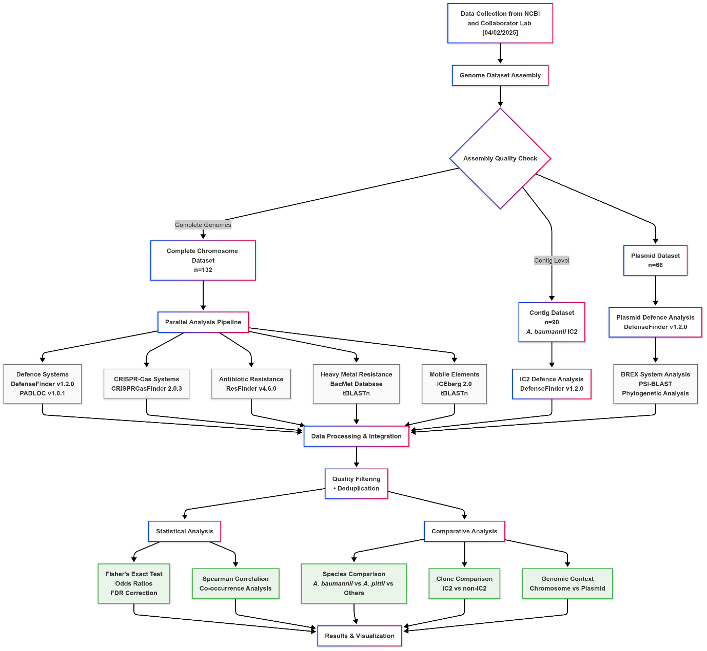

# Adaptive trade-offs between niche-driven defence system selection and horizontal gene transfer suggests clinical success in Acinetobacter spp. 

## Project Overview

This repository investigates the complex interplay between bacterial defense systems and antimicrobial resistance in Acinetobacter species. Our analysis reveals how clinical pathogens balance phage protection with genetic plasticity, providing insights into resistance evolution and potential therapeutic targets.

**Clinical Significance:** *A. baumannii* has emerged as a critical healthcare threat due to its exceptional ability to acquire resistance. Understanding defense system trade-offs is essential for predicting resistance patterns and developing targeted interventions.

## Dataset

The analysis was performed on two distinct datasets:
- 132 complete *Acinetobacter* genomes (including 43 *A. baumannii*, 27 *A. pittii*, and 62 other *Acinetobacter* species)
- 90 contig-level assemblies of *A. baumannii* clinical isolates

## Repository Structure

- `code/`: R and Bash scripts for computational analysis
- `data/`: Metadata about genomes and example datasets
- `methods/`: Workflow figure
- `environment/`: Conda environment files

## Methodology Overview

The bioinformatic workflow involved:

1. **Genome Analysis**: Using DefenseFinder and PADLOC to predict defence systems
2. **Antibiotic Resistance Gene Detection**: Identification using ResFinder
3. **Mobile Genetic Element Analysis**: BLAST-based identification of integrative mobile elements
4. **Statistical Analysis**: Correlation analysis using Fisher's exact tests and Spearman's rank correlation
5. **Visualization**: Generation of heatmaps, network visualizations, and statistical plots

## Prerequisites

- R (version 4.4.0 or higher)
- [DefenseFinder](https://github.com/mdmparis/defense-finder)
- [PADLOC](https://github.com/padlocbio/padloc)
- [ResFinder](https://github.com/genomicepidemiology/resfinder)
- [CasFinder](https://github.com/macsy-models/CasFinder)
- NCBI E-utilities (for genome download)

## Installation

1. Clone this repository: https://github.com/vikos77/Acinetobacter-defence-systems.git

2. Install R and required packages

3. Install bioinformatics tools:
- DefenseFinder: Follow instructions at [DefenseFinder](https://github.com/mdmparis/defense-finder)
- PADLOC: Follow instructions at [PADLOC](https://github.com/padlocbio/padloc)
- Resfinder : Follow instructions at [Resfinder](https://github.com/genomicepidemiology/resfinder)
- Casfinder : Follow instructions at [Casfinder](https://github.com/macsy-models/CasFinder)

### Key Findings

| Finding | Impact | Clinical Relevance |
|---------|--------|-------------------|
| **IC2 Defense Specialization** | IC2 clones carry specialized SspBCDE systems | Explains pandemic success of clinical lineage |
| **Defense-Resistance Trade-offs** | RM systems restrict resistance acquisition | Potential targets for resistance modulation |
| **Mobile Element Networks** | Defense systems regulate HGT dynamics | Insights for phage therapy design |
| **Species-Specific Patterns** | Distinct defense profiles across species | Species-targeted therapeutic strategies |

### Core Discoveries

- **132 genomes analyzed** across 18 *Acinetobacter* species with comprehensive defense system mapping
- **Novel IC2 adaptations**: Streamlined defense architecture (1-2 systems vs. ~5 in other strains) facilitates resistance acquisition
- **Defense system trade-offs**: Restriction-Modification systems inversely correlate with antibiotic resistance genes (r = -0.11)
- **Mobile element facilitation**: SspBCDE and Gao_Qat systems show positive associations with horizontal gene transfer
- **Statistical rigor**: Correlation analyses with multiple testing correction reveal robust genomic patterns

## Contact & Support

** Corresponding Author:** Saadlee Shehreen (s.shehreen@tees.ac.uk) 
** Lead Analyst:** Vigneshwaran Muthuraman (vigneshwaran0594@gmail.com)
** Institution:** Teesside University, UK