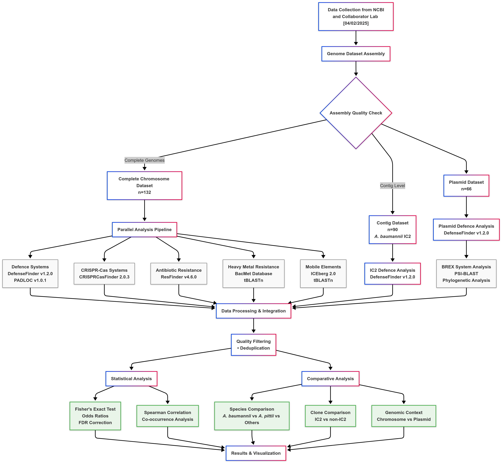
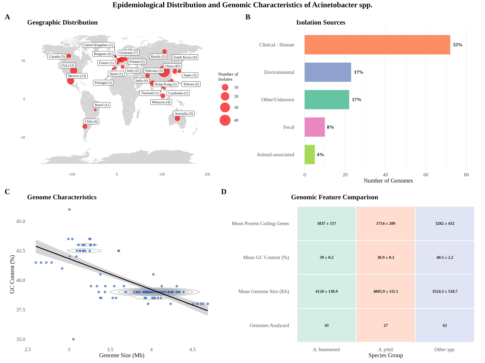
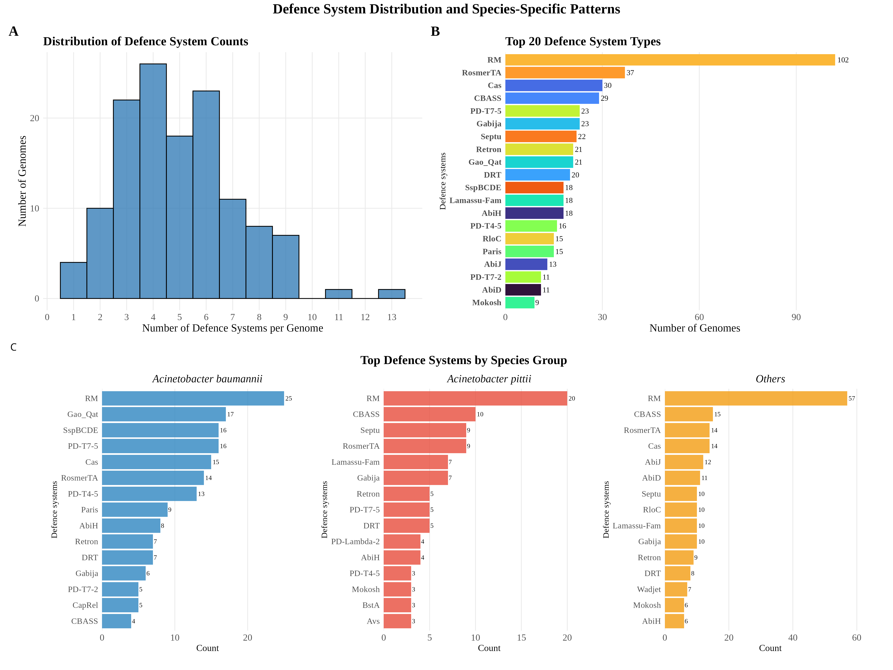
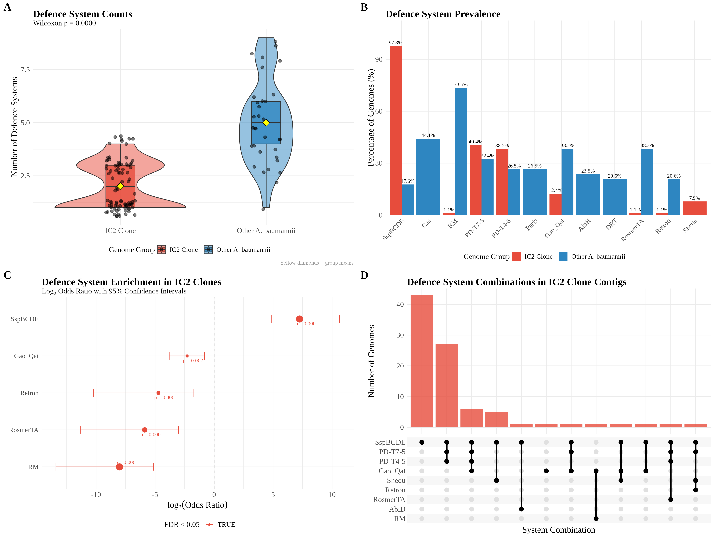
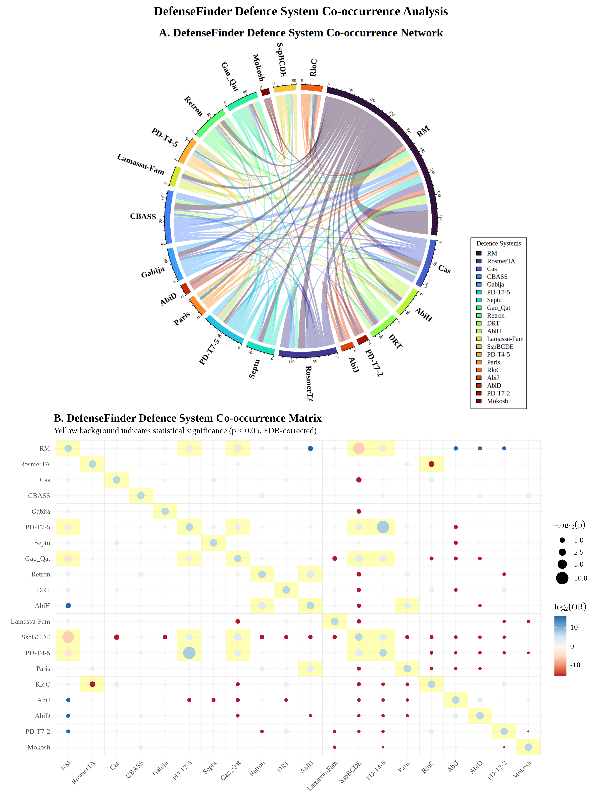
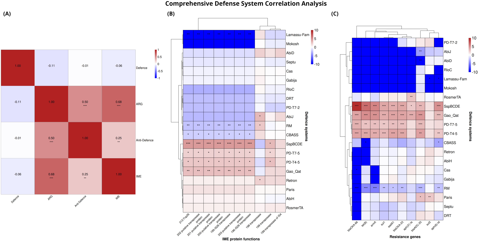

# The balance between defence systems and horizontal gene transfer shapes adaptation in clinical strains of _Acinetobacter_ spp.

[](https://opensource.org/licenses/MIT)

**Published:** Muthuraman V, Roy P, Dean P, Lopes BS, Shehreen S. (2026). *Journal of Applied Microbiology*, lxag069. [DOI: 10.1093/jambio/lxag069](https://doi.org/10.1093/jambio/lxag069)

---

## Overview

Statistical analysis and visualisation repository for the above publication. Investigates the interplay between bacterial defence systems, antibiotic resistance gene carriage, and horizontal gene transfer dynamics across clinical *Acinetobacter* species.

*A. baumannii* is a WHO critical-priority pathogen — notorious for acquiring resistance and evading clinical interventions. The relationship between its phage defence architecture and resistance gene carriage was poorly characterised at scale. This repository contains all R and Bash code used to perform that analysis and produce the published figures.

---

## Dataset

Two datasets used in the analysis, both available via NCBI:

| Dataset | Description | Size |
|---------|-------------|------|
| Complete genomes | 132 complete *Acinetobacter* genomes across 18 species (43 *A. baumannii*, 27 *A. pittii*, 62 other) | 132 genomes |
| Clinical isolates | 90 contig-level assemblies of *A. baumannii* clinical isolates | 90 genomes |

NCBI accession numbers for all genomes are listed in [`data/metadata/accession_list.txt`](data/metadata/accession_list.txt).

---

## Repository Structure

```
Acinetobacter-defence-systems/
├── code/
│   ├── 1_pipeline/               # Bash scripts: genome download through tool execution
│   │   ├── 01_download_genomes.sh
│   │   ├── 02_run_defensefinder.sh
│   │   ├── 03_run_padloc.sh
│   │   ├── 04_run_resfinder.sh
│   │   ├── 05_consolidate_results.sh
│   │   ├── 06_consolidate_resfinder.sh
│   │   ├── 07_run_antidefensefinder.sh
│   │   ├── 08_perform_tblastn.sh
│   │   ├── 09_crispr_pipeline_script.sh
│   │   └── 10_HMRG_perform_tblastn.sh
│   └── 2_analysis/               # R scripts: statistical analysis and figure generation
│       ├── 1_defence_system_analysis.R
│       ├── 2_defence_cooccurrence_analysis.R
│       ├── 3_ic2_clone_analysis.R
│       ├── 4_resistance_gene_analysis.R
│       ├── 5_antidefense_analysis.R
│       ├── 6_ime_analysis.R
│       ├── 7_HMRG_analysis.R
│       ├── 8_final_correlation_analysis.R
│       └── 9_crispr_cas_analysis.R
├── data/
│   └── metadata/
│       ├── accession_list.txt    # NCBI accession numbers for all 222 genomes
│       └── Acinetobacter_metadata.xlsx
├── environment/                  # Conda environment files per tool
│   ├── defensefinder.yaml
│   ├── padloc.yaml
│   ├── resfinder.yaml
│   └── crisprcasfinder_env.yaml
├── methods/
│   └── figures/
│       └── methodology_workflow.png
├── results/
│   └── figures/
│       └── main/                 # Figures 1-6
└── LICENSE
```

---

## Methodology


The pipeline runs in two stages:

**Stage 1: Bioinformatic pipeline** (`code/1_pipeline/`)
1. Genome download from NCBI using accession list
2. Defence system prediction with DefenseFinder and PADLOC
3. Antibiotic resistance gene identification with ResFinder
4. Anti-defence system prediction with AntiDefenseFinder
5. Integrative mobile element (IME) identification via tBLASTn against SILVA
6. CRISPR-Cas system characterisation with CRISPRCasFinder
7. Heavy metal resistance gene (HMRG) identification

**Stage 2: Statistical analysis** (`code/2_analysis/`)

R scripts run in numbered order, each producing figures and summary tables for the corresponding section of the paper.

---

## Installation

Each bioinformatic tool has its own conda environment to avoid dependency conflicts.

```bash
# Clone the repository
git clone https://github.com/vikos77/Acinetobacter-defence-systems.git
cd Acinetobacter-defence-systems

# Create tool environments
conda env create -f environment/defensefinder.yaml
conda env create -f environment/padloc.yaml
conda env create -f environment/resfinder.yaml
conda env create -f environment/crisprcasfinder_env.yaml
```

**R packages** (install once in R 4.4.0+):

```r
install.packages(c(
  "tidyverse", "ggplot2", "ggrepel", "ggupset",
  "pheatmap", "viridis", "RColorBrewer", "reshape2",
  "patchwork", "cowplot", "gridExtra", "scales"
))
```

---

## Figures

### Figure 1: Analytical pipeline

*Complete bioinformatic workflow from NCBI genome collection through parallel defence system, resistance gene, mobile element, and CRISPR-Cas analysis, to statistical analysis and visualisation.*

---

### Figure 2: Epidemiological distribution and genomic characteristics

*Geographic distribution of isolates (A), isolation source breakdown — 55% clinical-human (B), GC content vs genome size across species (C), and genomic feature comparison across A. baumannii, A. pittii, and other spp. (D).*

---

### Figure 3: Defence system distribution and species-specific patterns

*Distribution of defence system counts per genome (A), top 20 defence system types across the dataset (B), and species-specific defence system profiles comparing A. baumannii, A. pittii, and others (C).*

---

### Figure 4: IC2 clone defence system characterisation

*Defence system counts in IC2 vs other A. baumannii (Wilcoxon p < 0.0001) (A), prevalence comparison (B), enrichment analysis by odds ratio with FDR correction showing SspBCDE enrichment in IC2 (C), and defence system combinations in IC2 contigs (D).*

---

### Figure 5: Defence system co-occurrence analysis

*Chord diagram of defence system co-occurrence network (A) and co-occurrence matrix showing statistically significant pairings (FDR-corrected, p < 0.05) by odds ratio (B).*

---

### Figure 6: Comprehensive defence-resistance-HGT correlation analysis

*Correlation matrix of defence system categories vs anti-defence, mobile elements, and resistance genes (A), defence system vs IME protein function heatmap (B), and defence system vs resistance gene association heatmap (C).*

---

## Key Findings

| Finding | Detail | Clinical Relevance |
|---------|--------|--------------------|
| IC2 defence specialisation | IC2 clones carry SspBCDE systems (1-2 total vs. ~5 in other strains) | Streamlined architecture facilitates resistance acquisition |
| Defence-resistance trade-off | RM systems inversely correlate with resistance gene load (r = -0.11) | RM systems restrict horizontal gene transfer |
| Mobile element facilitation | SspBCDE and Gao_Qat associate positively with HGT | Co-acquisition of defence and resistance via shared genomic neighbourhoods |
| Species-specific profiles | Distinct defence architectures across 18 *Acinetobacter* species | Species-targeted therapeutic and phage therapy design |

---

## Citation

```bibtex
@article{muthuraman2026acinetobacter,
  title={The balance between defence systems and horizontal gene transfer shapes
  adaptation in clinical strains of Acinetobacter spp.},
  author={Muthuraman, Vigneshwaran and Roy, Proyash and Dean, Paul and
  Lopes, Bruno Silvester and Shehreen, Saadlee},
  year={2026},
  journal={Journal of Applied Microbiology},
  pages={lxag069},
  doi={10.1093/jambio/lxag069},
  url={https://doi.org/10.1093/jambio/lxag069}
}
```

---

## Contact

**Lead Analyst:** Vigneshwaran Muthuraman (vigneshwaran0594@gmail.com)
**Corresponding Author:** Saadlee Shehreen (s.shehreen@tees.ac.uk)
**Institution:** Teesside University, UK
