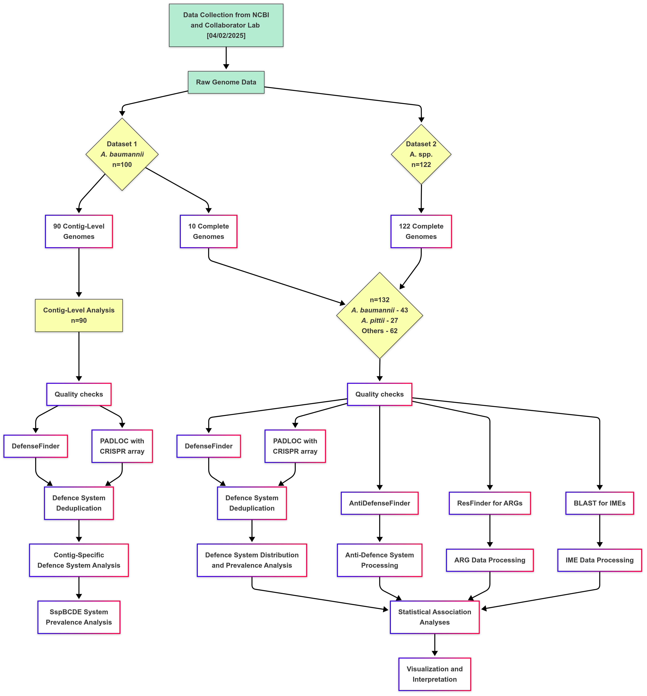
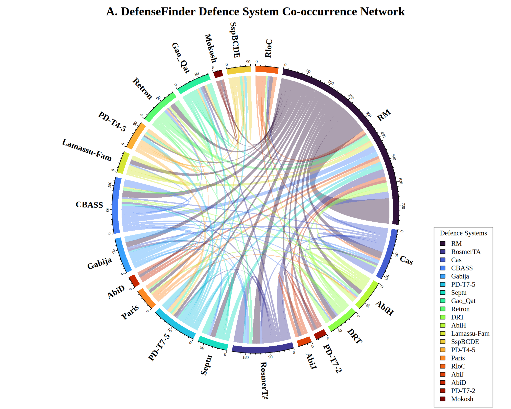

# Defence System Architecture in *Acinetobacter* Species

[](https://opensource.org/licenses/MIT)

## Project Overview

This repository contains the code, analysis, and findings from my Master's thesis research on bacterial defence systems in *Acinetobacter* species, with a focus on their relationship to antimicrobial resistance and mobile genetic elements.

*Acinetobacter baumannii* has emerged as a significant healthcare challenge due to its remarkable ability to acquire antimicrobial resistance. This project investigates the complex landscape of bacterial defence systems across different *Acinetobacter* species, examining how these systems might influence the acquisition and maintenance of resistance determinants.

## Key Research Objectives

- Map the distribution and organization of defence systems across *Acinetobacter* species
- Compare defence system predictions between DefenseFinder and PADLOC bioinformatic tools
- Analyze species-specific variations in defence strategies between *A. baumannii*, *A. pittii*, and other *Acinetobacter* species
- Explore correlations between defence systems and antibiotic resistance genes
- Investigate relationships between defence systems and mobile genetic elements

## Dataset

The analysis was performed on two distinct datasets:
- 132 complete *Acinetobacter* genomes (including 43 *A. baumannii*, 27 *A. pittii*, and 62 other *Acinetobacter* species)
- 90 contig-level assemblies of *A. baumannii* clinical isolates

## Key Findings

1. **Restriction-Modification (RM) Systems Dominate**: RM systems emerge as the predominant defence mechanism across all *Acinetobacter* species.

2. **Species-Specific Defence Profiles**: 
   - *A. baumannii* exhibits enrichment of Gao_Qat, SspBCDE, and PD-T7-5 systems
   - *A. pittii* shows prevalence of CBASS and Septu systems but notably lacks SspBCDE

3. **Defence System-ARG Relationships**: Significant associations between specific defence systems and antibiotic resistance genes:
   - Gao_Qat systems show strong positive associations with multiple resistance genes
   - RM systems display negative associations with the same resistance determinants

4. **SspBCDE in Clinical Isolates**: SspBCDE emerges as a cornerstone defence system in *A. baumannii*, frequently occurring as the sole defence mechanism in clinical isolates.

5. **Evolutionary Trade-Off**: Our findings reveal a fundamental evolutionary trade-off between phage protection and genomic plasticity.

## Repository Structure

- `code/`: R and Bash scripts for computational analysis
- `data/`: Metadata about genomes and example datasets
- `results/`: Key figures and findings
- `docs/`: Additional documentation including thesis summary

## Methodology Overview

The bioinformatic workflow involved:

1. **Genome Analysis**: Using DefenseFinder and PADLOC to predict defence systems
2. **Antibiotic Resistance Gene Detection**: Identification using ResFinder
3. **Mobile Genetic Element Analysis**: BLAST-based identification of integrative mobile elements
4. **Statistical Analysis**: Correlation analysis using Fisher's exact tests and Spearman's rank correlation
5. **Visualization**: Generation of heatmaps, network visualizations, and statistical plots



## Visualizations

The repository includes key visualizations:


*Defence system Co-occurrence across 132 Acinetobacter species*

## Prerequisites

- R (version 4.4.0 or higher)
- [DefenseFinder](https://github.com/mdmparis/defense-finder)
- [PADLOC](https://github.com/padlocbio/padloc)
- [ResFinder](https://github.com/genomicepidemiology/resfinder)
- NCBI E-utilities (for genome download)

## Installation

1. Clone this repository: https://github.com/vikos77/Acinetobacter-defence-systems.git

2. Install R and required packages

3. Install bioinformatics tools:
DefenseFinder: Follow instructions at [DefenseFinder](https://github.com/mdmparis/defense-finder)
PADLOC: Follow instructions at [PADLOC](https://github.com/padlocbio/padloc)
Resfinder : Follow instructions at [Resfinder](https://github.com/genomicepidemiology/resfinder)

## Citation

If you use any of the code or findings from this project, please cite:

```
Muthuraman, V. (2025). Defence System Architecture in Acinetobacter: 
Species-Specific Patterns and Implications for Antimicrobial Resistance. 
Masters Thesis, Teesside University.
```

## License

This project is licensed under the MIT License - see the [LICENSE](LICENSE) file for details.

## Acknowledgements

I would like to express my sincere gratitude to my supervisor, Dr. Shehreen Saadlee, for her invaluable guidance and support throughout this research project.
